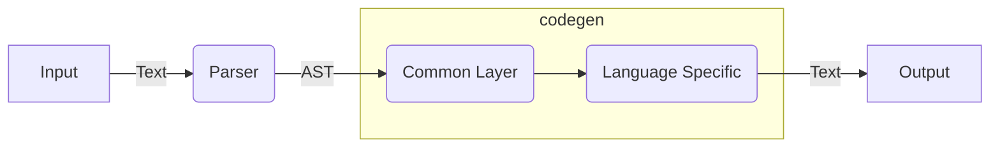

# procon-input-compiler

This is a compiler project behind [Procon Input](https://akiradeveloper.github.io/procon-input/).

## Overview

If you play competitive programming,
you should be bothered parsing the input.

The syntax of the input is usually something like this:

```
N M
X1 Y1
X2 Y2
...
XM YM
```

You may be parsing the input by writing boilarplate code but
imagine what if you can parse the input from the syntax itself.

```
n: int, m: int
xy: [(int,int); m]
```

This is what Procon Input does.


## Supported Languages

- Supported languages: Python3, C++11, Nim, Ruby, Java, C#

|name | syntax | Python3 | C++11 | Nim | Ruby | Java | C# |
|-|-|-|-|-|-|-|-|
|integer number|int|`int`|`int`|`int`|`Integer`|`Integer`|`int`|
|floating number|float|`float`|`double`|`float`|`Float`|`Float`|`double`|
|string|str|`str`|`string`|`string`|`String`|`String`|`string`|
|tuple|(A,B)|`(A,B)`|`tuple<A,B>`|`(A,B)`|`[A,B]`|Not Supported|`ValueTuple<A,B>`|
|array|[A;n]|`[A]`|`vector<A>`|`seq[A]`|`[A]`|`ArrayList<A>`|`List<A>`|
|list|[A]|`[A]`|`vector<A>`|`seq[A]`|`[A]`|`ArrayList<A>`|`List<A>`|
|matrix|[A;n]|`[A]`|`vector<A>`|`seq[A]`|`[A]`|`ArrayList<A>`|`List<A>`|

## Syntax

```
Root := Line in-between ‘\n’
Line := Definition in-between ‘,‘
Definition := Var : Type

UnitType := int | int0 | float | str
Array := [UnitType; Len]
List := [UnitType]

TupleElem := UnitType | Array | List
Tuple := (TupleElem in-between ‘,’)
TupleLike := Array | List | Tuple

Matrix := [TupleLike; Len]
Type := UnitType | TupleLike | Matrix
```

## Architecuture



## Related Works

- [proconio](https://github.com/statiolake/proconio-rs)
- [proconIO.jl](https://github.com/lucifer1004/ProconIO.jl)

## Author

Akira Hayakawa (@akiradeveloper)

